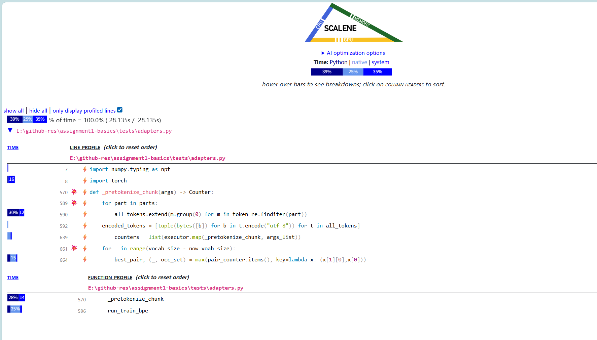
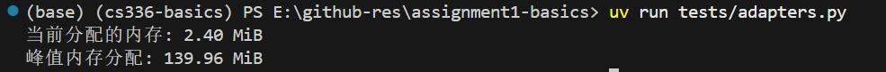

（1）What are some reasons to prefer training our tokenizer on UTF-8 encoded bytes, rather than UTF-16 or UTF-32?

utf-32和utf-16都冗余很多

unicode解码有时一个字符会用多个编码表示，因此逐个字符解码会出错

```
$env:Path = "C:\Users\tangy\.local\bin;$env:Path"
```

```bash
git config --global core.autocrlf false
git restore .
```

找了一下午问题，发现是不应该开进程，进程启动速度太慢，改成线程就好了

```bash
uv add scalene
uv run scalene your_script.py
```



这里可以看到一个是预分词中应用正则表达式消耗大，一个是求最大值时要遍历整个token_list



内存没什么问题

emmm我刚刚发现这是sample的数据（当然没问题。。。）
